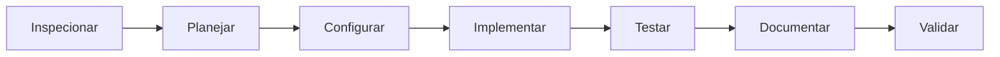
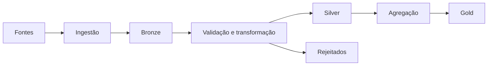

# Projetos Python de Engenharia de Dados

Use estas instruções para criar ou padronizar projetos Python de dados. Antes de alterar um projeto existente, inspecione sua estrutura e preserve decisões válidas. Adote apenas as camadas necessárias; não crie módulos vazios por convenção.

## Fluxo de trabalho



1. Identifique objetivo, fontes, destinos, volume e frequência do pipeline.
2. Verifique versões do Python, Poetry e dependências existentes.
3. Defina a menor arquitetura que atenda ao projeto.
4. Implemente código, testes e documentação em conjunto.
5. Execute todas as validações antes de concluir.
6. Informe o que foi executado e qualquer validação pendente. Nunca declare que um teste passou sem executá-lo.

## Sumário

1. [Estrutura de Diretórios](#1-estrutura-de-diretórios)
2. [Gerenciamento de Ambiente com Poetry](#2-gerenciamento-de-ambiente-com-poetry)
3. [Modularização e Arquitetura](#3-modularização-e-arquitetura)
4. [Qualidade de Código](#4-qualidade-de-código)
5. [Testes](#5-testes)
6. [Documentação](#6-documentação)
7. [Boas Práticas Adicionais](#7-boas-práticas-adicionais)
8. [Padrões de Pull Request](#8-padrões-de-pull-request)
9. [Convenções de Nomenclatura](#9-convenções-de-nomenclatura)

## 1. Estrutura de Diretórios

### 1.1 Padrão `src/<pacote>`

Use o padrão `src/<pacote>`. Os testes devem acompanhar a organização do código-fonte.

```text
projeto/
├── src/
│   └── <pacote>/
│       ├── __init__.py
│       ├── ingestion/       # extração de APIs, bancos e arquivos
│       ├── transformation/  # limpeza e regras de transformação
│       ├── validation/      # schemas e qualidade dos dados
│       ├── load/            # escrita nos destinos
│       └── config.py        # configurações centralizadas
├── tests/
│   └── <pacote>/            # espelha os módulos relevantes de src/
├── data/
│   ├── raw/                 # Bronze: dados brutos e imutáveis
│   ├── interim/             # Silver: dados limpos e tipados
│   ├── processed/           # Gold: dados prontos para consumo
│   └── rejected/            # registros rejeitados, quando necessário
├── docs/
├── .github/workflows/
├── .env.example
├── .gitignore
├── .python-version
├── mkdocs.yml
├── pyproject.toml
├── poetry.lock
└── README.md
```

- Crie `ingestion/`, `transformation/`, `validation/` e `load/` somente quando essas etapas existirem.

### 1.2 Camadas de dados

- `raw/` (Bronze): dados brutos e imutáveis, sem transformação.
- `interim/` (Silver): dados limpos, tipados e deduplicados.
- `processed/` (Gold): dados modelados prontos para consumo.
- `rejected/`: registros que falharam validação, quando aplicável.

### 1.3 Regras de organização

- Mantenha a lógica da aplicação dentro de `src/`; evite scripts soltos e duplicados.
- Ignore os arquivos reais de `data/`, preservando somente a estrutura com `.gitkeep` quando necessário.
- Inclua `.env`, `.venv`, dados e caches no `.gitignore`.
- Não use notebooks como execução principal de produção.

## 2. Gerenciamento de Ambiente com Poetry

### 2.1 Versão do Python com pyenv

Fixe a versão local do Python com pyenv:

```bash
pyenv install <versao>
pyenv local <versao>
```

### 2.2 Configuração do Poetry

Configure o Poetry para manter a `.venv` no projeto:

```bash
poetry config virtualenvs.in-project true --local
poetry install
```

### 2.3 Gerenciamento de dependências

Gerencie todas as dependências do projeto pelo Poetry:

```bash
poetry add pandas sqlalchemy
poetry add --group dev ruff pytest pytest-cov mkdocs-material
poetry run <comando>
```

- Use `poetry add` e `poetry remove` para incluir ou retirar dependências.
- Use grupos (`--group dev`) para separar dependências de desenvolvimento das dependências de execução.
- Use `poetry run <comando>` para executar qualquer ferramenta dentro do ambiente do projeto.

### 2.4 Obrigatoriedades

Regras que devem sempre ser seguidas no gerenciamento do ambiente:

- Nunca instale dependências do projeto diretamente com `pip`.
- Nunca edite a lista de dependências manualmente no `pyproject.toml`; use sempre `poetry add`/`poetry remove`.
- Sempre versione `.python-version`, `pyproject.toml` e `poetry.lock` no controle de versão.
- Garanta que `poetry install` reconstrua o ambiente de forma idêntica no ambiente local e na CI, a partir do `poetry.lock`.
- Rode `poetry check` antes de considerar o ambiente válido, para garantir consistência entre `pyproject.toml` e `poetry.lock`.

### 2.5 Versionamento Semântico

O campo `version` do `pyproject.toml` deve seguir [Versionamento Semântico](https://semver.org/lang/pt-BR/) (`MAJOR.MINOR.PATCH`):

- **MAJOR**: mudanças incompatíveis com versões anteriores (breaking changes).
- **MINOR**: novas funcionalidades compatíveis com versões anteriores.
- **PATCH**: correções de bugs compatíveis com versões anteriores.

Use o comando do Poetry para incrementar a versão em vez de editar o arquivo manualmente:

```bash
poetry version patch   # 0.1.0 -> 0.1.1
poetry version minor   # 0.1.1 -> 0.2.0
poetry version major   # 0.2.0 -> 1.0.0
```

- Mantenha a versão do `pyproject.toml` sincronizada com a tag Git da release (ex.: `v0.2.0`).
- Enquanto o projeto estiver em desenvolvimento inicial e instável, use `0.MINOR.PATCH` (`MAJOR = 0`).
- Documente mudanças relevantes de cada versão (ex.: `CHANGELOG.md`), quando o projeto exigir rastreabilidade de releases.

### 2.6 Configuração mínima do pyproject.toml

Configuração mínima recomendada, no padrão PEP 621 com backend `poetry-core`:

```toml
[project]
name = "<pacote>"
version = "0.1.0"
description = ""
authors = [
    {name = "Nome do Autor", email = "autor@example.com"}
]
readme = "README.md"
requires-python = ">=3.12"
dependencies = [
]

[tool.poetry]
packages = [{include = "<pacote>", from = "src"}]

[build-system]
requires = ["poetry-core>=2.0.0,<3.0.0"]
build-backend = "poetry.core.masonry.api"
```

Campos obrigatórios:

- `name`: nome do projeto (não precisa ser igual ao nome do pacote importável).
- `version`: versão semântica atual do projeto (ver [Versionamento Semântico](#25-versionamento-semântico)).
- `requires-python`: versão mínima de Python suportada, alinhada ao `.python-version`.
- `readme`: caminho do arquivo de descrição do projeto.
- `dependencies`: lista de dependências de execução, sempre gerenciada via `poetry add` (nunca editada manualmente).
- `[tool.poetry].packages`: mapeia o pacote importável em `src/<pacote>` para o build do Poetry.
- `[build-system]`: define `poetry-core` como backend de build; não deve ser removido nem alterado sem necessidade.

## 3. Modularização e Arquitetura

Separe responsabilidades e mantenha a orquestração explícita.



### 3.1 Fluxo de dados

- Bronze preserva a fonte sem alterações destrutivas.
- Silver contém dados tipados, limpos e deduplicados.
- Gold contém dados modelados para consumo.
- Use esse fluxo somente quando o tamanho e a complexidade justificarem as camadas.

### 3.2 Separação de responsabilidades

- Centralize configurações em `config.py` ou `settings.py`.
- Encadeie etapas em `main.py`, `pipeline.py` ou em um orquestrador adequado.
- Evite imports cruzados que acoplem ingestão, transformação e carga.

### 3.3 Testabilidade

- Faça funções receberem conexões, clientes e caminhos como parâmetros para facilitar testes.

## 4. Qualidade de Código

### 4.1 Configuração do Ruff

Configure Ruff no `pyproject.toml`:

```toml
[tool.ruff]
line-length = 100
target-version = "py312"

[tool.ruff.lint]
select = ["E", "F", "I", "UP", "B", "N", "S", "C90"]

[tool.ruff.lint.per-file-ignores]
"tests/**/*.py" = ["S101"]

[tool.ruff.format]
quote-style = "double"
```

Substitua `target-version` pela versão real do projeto.

### 4.2 Execução de lint e format

```bash
poetry run ruff check src tests --fix
poetry run ruff format src tests
```

### 4.3 Boas práticas de código

- Use type hints em funções públicas.
- Prefira nomes descritivos, funções pequenas e responsabilidade única.
- Use `logging` em vez de `print` para observabilidade.
- Registre etapa, lote, duração e quantidade de registros, sem expor dados sensíveis.
- Capture exceções específicas. Não use `except Exception: pass`.
- Separe regras de negócio de acesso a APIs, arquivos e bancos.

## 5. Testes

### 5.1 Configuração

Use pytest e pytest-cov. Configure o nome importável do pacote, não o caminho `src/<pacote>`:

```toml
[tool.pytest.ini_options]
testpaths = ["tests"]
addopts = "--cov=<pacote> --cov-report=term-missing --cov-fail-under=50"

[tool.coverage.run]
branch = true
source = ["<pacote>"]
```

### 5.2 Execução

```bash
poetry run pytest
```

- Mantenha cobertura mínima real de 50%; não reduza o limite para fazer a validação passar.

### 5.3 O que testar

- Teste transformações, validações, idempotência, nulos, duplicados, tipos inesperados e entradas vazias.
- Teste comportamento e resultados, não detalhes internos nem linhas artificiais.

### 5.4 Mocks e testes de integração

- Substitua APIs e bancos por mocks ou fixtures nos testes unitários.
- Separe e identifique testes de integração que dependam de serviços externos.

## 6. Documentação

### 6.1 MkDocs Material

```bash
poetry add --group dev mkdocs-material
poetry run mkdocs serve
poetry run mkdocs build --strict
```

### 6.2 Conteúdo esperado

A documentação deve refletir o projeto real e conter, quando aplicável:

- visão geral e objetivo;
- instalação e configuração;
- arquitetura e fluxo dos dados;
- execução dos pipelines;
- testes e regras de qualidade;
- entradas, saídas e decisões de negócio.

### 6.3 README e docstrings

- Mantenha o `README.md` curto: objetivo, instalação, execução e link para a documentação completa.
- Use docstrings em funções públicas não triviais.

## 7. Boas Práticas Adicionais

### 7.1 Idempotência e processamento incremental

- Garanta que o mesmo lote possa ser reprocessado sem duplicar dados.
- Prefira `upsert`, `merge` ou substituição controlada de partições a `append` cego.
- Use watermark, timestamp de atualização ou chave incremental quando adequado.
- Registre checkpoints somente após a conclusão segura do lote.

### 7.2 Qualidade e contratos de dados

- Defina schema, tipos, campos obrigatórios, chaves e intervalos válidos.
- Documente a decisão para nulos: rejeitar, imputar ou preservar.
- Defina a chave natural e a regra de deduplicação de cada entidade.
- Isole registros inválidos em uma área de rejeitados; não os descarte silenciosamente.
- Registre contagens de entrada, saída, rejeição e duplicidade.

### 7.3 Segurança e configuração

- Nunca grave credenciais, tokens ou strings de conexão no código.
- Use variáveis de ambiente e mantenha `.env.example` sem valores reais.
- Valide configurações obrigatórias na inicialização.
- Não registre credenciais, PII ou payloads sensíveis em logs.
- Aplique o princípio do menor privilégio em bancos e serviços.

### 7.4 APIs e operações externas

- Configure timeout, paginação, limite de retentativas e backoff.
- Respeite limites de requisição e trate respostas parciais.
- Use transações e escritas atômicas em operações críticas quando possível.
- Falhe com mensagem clara e código de saída diferente de zero em erros críticos.

### 7.5 Integração contínua

Configure a CI para usar a versão do Python definida pelo projeto, instalar pelo Poetry e executar lint, testes, cobertura e build da documentação. Uma falha deve impedir o merge.


### 7.6 Checklist final de entrega

Execute, nesta ordem:

```bash
poetry check
poetry install
poetry run ruff check src tests
poetry run ruff format --check src tests
poetry run pytest
poetry run mkdocs build --strict
```

Considere a entrega concluída somente quando as validações aplicáveis passarem. Se alguma não puder ser executada, registre o motivo de forma objetiva.

## 8. Padrões de Pull Request

### 8.1 Antes de abrir o PR

- Atualize a branch com a branch principal antes de abrir o PR.
- Execute o [checklist final de entrega](#76-checklist-final-de-entrega) e garanta que todas as validações aplicáveis passem.
- Confirme que não há dados reais, segredos, tokens ou arquivos temporários no diff.

### 8.2 Título e descrição

Use o padrão [Conventional Commits](https://www.conventionalcommits.org/pt-br/) no título:

```text
<tipo>(<escopo>): <descrição curta no imperativo>
```

Tipos comuns: `feat`, `fix`, `docs`, `refactor`, `test`, `chore`.

A descrição do PR deve conter:

- objetivo da mudança e contexto necessário;
- principais mudanças realizadas;
- como testar/validar localmente;
- referência à issue relacionada, quando existir.

### 8.3 Tamanho e escopo

- Prefira PRs pequenos e focados em um único objetivo.
- Separe refatorações de mudanças de comportamento sempre que possível.
- Evite misturar formatação em massa com mudanças funcionais no mesmo PR.

### 8.4 Critérios de aprovação

- CI verde (lint, testes, cobertura e build de documentação).
- Cobertura de testes mantida ou aumentada, nunca reduzida para passar na validação.
- Documentação atualizada quando a mudança afeta comportamento, configuração ou uso público.
- Nenhum comentário de revisão crítico pendente sem resposta.

## 9. Convenções de Nomenclatura

### 9.1 Arquivos e módulos

- Use `snake_case` para arquivos e módulos Python (ex.: `data_loader.py`).
- Use nomes descritivos do conteúdo do módulo; evite abreviações obscuras.

### 9.2 Variáveis e funções

- Use `snake_case` para variáveis e funções.
- Nomeie funções com verbos que descrevam a ação (ex.: `load_raw_data`, `validate_schema`).

### 9.3 Classes

- Use `PascalCase` para classes (ex.: `WeatherLoader`, `LapValidator`).

### 9.4 Constantes

- Use `UPPER_SNAKE_CASE` para constantes de módulo (ex.: `DEFAULT_TIMEOUT`, `RAW_DATA_PATH`).

### 9.5 Branches

- Use o padrão `tipo/descricao-curta`, com `tipo` alinhado aos tipos de commit (ex.: `feature/ingestao-laps`, `fix/timeout-api`, `chore/atualiza-dependencias`).

### 9.6 Arquivos e funções de teste

- Nomeie arquivos de teste como `test_<modulo>.py`, espelhando o módulo testado em `src/`.
- Nomeie funções de teste como `test_<comportamento_esperado>` (ex.: `test_rejeita_registro_sem_chave`).
