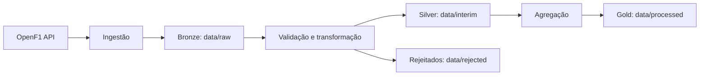

# Plano — F1 Project (Pipeline de Dados OpenF1)

> Baseado em [doc_api.md](doc_api.md) (API OpenF1) e [SKILL.md](SKILL.md) (padrão de projetos Python de Engenharia de Dados).
> Estado atual do repo: scaffold mínimo (`src/f1_project/__init__.py`, `tests/__init__.py`, `pyproject.toml` sem dependências, sem `.gitignore`/`.env.example`/CI). Este plano assume que vamos construir a partir daqui, sem quebrar o que já existe.

## 1. Objetivo

Construir um pipeline de engenharia de dados que extrai dados históricos da [OpenF1 API](https://openf1.org/docs/#api-endpoints), aplica limpeza/validação e disponibiliza dados prontos para consumo (análises de corrida, telemetria, estratégia de pneus, etc.), seguindo a arquitetura Bronze → Silver → Gold definida em [SKILL.md](SKILL.md#3-modularização-e-arquitetura).

- **Fonte:** `https://api.openf1.org/v1/` — dados históricos (>=2023), sem autenticação.
- **Frequência:** batch sob demanda (não é dado em tempo real; live exige assinatura paga, fora do escopo).
- **Volume:** por sessão de corrida, variável por endpoint (ex.: `car_data`/`location` a ~3.7 Hz podem gerar dezenas de milhares de linhas; `sessions`/`meetings` são pequenos).

## 2. Escopo dos dados (endpoints)

Não implementar todos os 17 endpoints de uma vez (evitar módulos vazios/prematuros — regra do SKILL.md). Priorizar por dependência e valor analítico:

| Fase | Endpoints | Motivo |
|---|---|---|
| MVP | `meetings`, `sessions`, `drivers` | Entidades de referência; toda análise depende de `session_key`/`driver_number` |
| Fase 2 | `laps`, `stints`, `pit` | Núcleo de performance e estratégia de corrida |
| Fase 3 | `position`, `intervals`, `session_result`, `starting_grid` | Classificação e dinâmica de posições |
| Fase 4 | `weather`, `race_control` | Contexto da sessão |
| Fase 5 (opcional) | `car_data`, `location`, `overtakes`, `team_radio`, `drivers_championship`, `teams_championship` | Alto volume ou dados incompletos/beta — avaliar necessidade antes de implementar |

`car_data`/`location` (alta frequência, ~3.7 Hz) exigem estratégia de paginação/particionamento própria; não iniciar por eles.

## 3. Arquitetura



- **Bronze (`data/raw`)**: resposta JSON crua da API, por endpoint/sessão, sem alteração.
- **Silver (`data/interim`)**: dados tipados (schema Pydantic ou similar), deduplicados pela chave natural do endpoint.
- **Gold (`data/processed`)**: tabelas agregadas/prontas para consumo (ex.: resumo de volta por piloto, histórico de stints por corrida).
- **Rejeitados (`data/rejected`)**: registros que falham validação de schema, com motivo do descarte.

### Chaves naturais por entidade (a confirmar na implementação)

- `meetings`: `meeting_key`
- `sessions`: `session_key`
- `drivers`: (`session_key`, `driver_number`)
- `laps`: (`session_key`, `driver_number`, `lap_number`)
- `stints`: (`session_key`, `driver_number`, `stint_number`)
- `pit`: (`session_key`, `driver_number`, `lap_number`)

## 4. Estrutura de diretórios alvo

Seguindo [SKILL.md §1](SKILL.md#1-estrutura-de-diretórios), criando apenas o que for necessário por fase:

```text
F1_project/
├── src/
│   └── f1_project/
│       ├── __init__.py
│       ├── config.py            # BASE_URL, timeout, retries, paths de data/
│       ├── ingestion/
│       │   ├── __init__.py
│       │   ├── client.py        # cliente HTTP genérico OpenF1 (GET + query params)
│       │   └── endpoints.py     # funções por endpoint (get_meetings, get_sessions, ...)
│       ├── transformation/
│       │   └── __init__.py      # limpeza/tipagem por entidade
│       ├── validation/
│       │   └── __init__.py      # schemas (ex.: Pydantic) e regras de qualidade
│       └── load/
│           └── __init__.py      # escrita em data/interim e data/processed (parquet)
├── tests/
│   └── f1_project/              # espelha src/f1_project
├── data/
│   ├── raw/.gitkeep
│   ├── interim/.gitkeep
│   ├── processed/.gitkeep
│   └── rejected/.gitkeep
├── docs/
├── .github/workflows/ci.yml
├── .env.example
├── .gitignore
├── .python-version
├── mkdocs.yml
├── pyproject.toml
├── poetry.lock
└── README.md
```

Módulos criados incrementalmente por fase (ex.: `load/` só ganha sentido quando houver o que persistir em Silver/Gold).

## 5. Ambiente e dependências

1. Fixar Python com pyenv (`pyenv local <versao>`, alinhado a `requires-python = ">=3.12"` já presente).
2. `poetry config virtualenvs.in-project true --local` + `poetry install`.
3. Dependências de execução (via `poetry add`, nunca manual):
   - `httpx` — cliente HTTP (suporta timeout/retries de forma simples).
   - `pydantic` — schemas de validação por entidade.
   - `pandas` — transformação e escrita em parquet.
   - `python-dotenv` — carregar `.env` (mesmo sem chave de API, útil para configs como timeout/base URL).
4. Dependências de dev (`--group dev`): `ruff`, `pytest`, `pytest-cov`, `mkdocs-material`, `respx` ou `pytest-httpx` (mock de chamadas HTTP nos testes).
5. Criar `.env.example` com variáveis não sensíveis (ex.: `OPENF1_BASE_URL`, `OPENF1_TIMEOUT_SECONDS`) — sem credenciais, já que o histórico é público.
6. Criar `.gitignore` (`.venv`, `data/raw/*`, `data/interim/*`, `data/processed/*`, `data/rejected/*`, `__pycache__`, `.env`).

## 6. Ingestão (`ingestion/`)

- `client.py`: função/classe única para `GET https://api.openf1.org/v1/<endpoint>` com:
  - query params dinâmicos (filtros `=`, `<`, `<=`, `>`, `>=` conforme [doc_api.md §Filtros](doc_api.md#filtros-e-query-params)).
  - timeout configurável e retry/backoff (SKILL.md §7.4) para falhas de rede.
  - suporte à keyword `latest` em `meeting_key`/`session_key`.
  - tratamento de resposta vazia/erro HTTP com mensagem clara.
- `endpoints.py`: uma função fina por endpoint ativo na fase corrente (ex.: `get_sessions(**filtros)`), delegando ao client — sem duplicar lógica de request.
- Persistência em Bronze: salvar JSON cru em `data/raw/<endpoint>/<session_key ou meeting_key>.json` (ou parquet cru, a definir na implementação).

## 7. Transformação e validação

- `validation/`: um schema por entidade (ex.: `SessionSchema`, `LapSchema`) definindo tipos, campos obrigatórios e faixas válidas (SKILL.md §7.2).
- `transformation/`: limpeza, cast de tipos, dedup pela chave natural, e roteamento de registros inválidos para `data/rejected` com o motivo da rejeição.
- Registrar contagens (entrada, saída, rejeitados, duplicados) via `logging`, nunca `print`.

## 8. Carga (`load/`)

- Silver: parquet particionado por `session_key` (ou `meeting_key` para `meetings`) em `data/interim/<entidade>/`.
- Gold: tabelas agregadas conforme necessidade analítica (ex.: melhor volta por piloto/sessão), em `data/processed/`.
- Escrita idempotente: reprocessar uma sessão deve sobrescrever a partição correspondente, não duplicar (SKILL.md §7.1).

## 9. Testes

- Unitários: mockar chamadas HTTP (`respx`/`pytest-httpx`) para `client.py`/`endpoints.py`; testar transformação e validação com fixtures de payloads reais da OpenF1 (nulos, duplicados, tipos inesperados, resposta vazia).
- Estrutura espelhando `src/`: `tests/f1_project/ingestion/`, `tests/f1_project/transformation/`, etc., criados conforme os módulos existirem.
- Configurar `pytest`/`coverage` no `pyproject.toml` (`--cov-fail-under=50`, ajustar pacote para `f1_project`).
- Marcar testes de integração reais (chamada à API viva) separadamente, e não rodá-los por padrão em CI.

## 10. Documentação

- MkDocs Material: visão geral do pipeline, endpoints cobertos por fase, arquitetura Bronze/Silver/Gold, como rodar a ingestão, decisões de schema/dedup.
- Manter `README.md` curto (hoje está vazio/corrompido — recriar com objetivo, instalação, execução e link para `docs/`).

## 11. Qualidade e CI

- Configurar `[tool.ruff]` e `[tool.pytest.ini_options]` no `pyproject.toml` conforme [SKILL.md §4](SKILL.md#4-qualidade-de-código) e [§5](SKILL.md#5-testes).
- Pipeline `.github/workflows/ci.yml`: `poetry install` → `ruff check`/`format --check` → `pytest` com cobertura → `mkdocs build --strict`.

## 12. Ordem de execução proposta

1. Estrutura base + ambiente (`pyproject.toml` completo, `.gitignore`, `.env.example`, `.python-version`, `poetry install`).
2. `config.py` + `ingestion/client.py` genérico, com teste mockado.
3. MVP: `meetings` → `sessions` → `drivers` ponta a ponta (ingest → bronze → silver), com testes e docs mínimas.
4. Validar checklist do [SKILL.md §7.6](SKILL.md#76-checklist-final-de-entrega) antes de avançar de fase.
5. Repetir o padrão para Fase 2 (`laps`, `stints`, `pit`), reutilizando `client.py` sem duplicar lógica.
6. Seguir para as fases seguintes conforme necessidade real de análise, revisando este plano se o escopo mudar.

## 13. Checklist de entrega (por fase)

```bash
poetry check
poetry install
poetry run ruff check src tests
poetry run ruff format --check src tests
poetry run pytest
poetry run mkdocs build --strict
```

Uma fase só é considerada concluída quando as validações acima passarem e a documentação refletir o que foi implementado.
