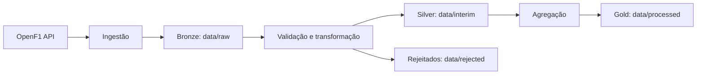

# Arquitetura

O pipeline segue o fluxo Bronze → Silver → Gold, com uma área separada para registros rejeitados na validação.

- **Bronze (`data/raw/<endpoint>/<batch_key>.json`)**: resposta JSON crua da API, sem alteração, por endpoint e lote de requisição (ex.: ano consultado ou `session_key`).
- **Silver (`data/interim/<endpoint>/<partição>.parquet`)**: dados tipados via schema Pydantic, deduplicados pela chave natural da entidade. Cada valor de partição sobrescreve seu próprio arquivo — reprocessar não duplica dados.
- **Gold (`data/processed/*.parquet`)**: tabelas agregadas prontas para consumo — voltas mais rápidas por circuito e pódio por corrida. Recalculadas por completo a partir de toda a Silver acumulada a cada execução do pipeline (não incremental).
- **Rejeitados (`data/rejected/<endpoint>/<batch_key>.json`)**: registros que falharam a validação de schema, junto do motivo da rejeição.

## Módulos

| Módulo | Responsabilidade |
|---|---|
| `config.py` | URL base, timeout, retries e caminhos de `data/`, lidos de variáveis de ambiente |
| `ingestion/client.py` | Cliente HTTP genérico (`GET /v1/<endpoint>`), com timeout e retry/backoff (inclui 429/`Retry-After`) |
| `ingestion/endpoints.py` | Uma função fina por endpoint ativo (`get_meetings`, `get_sessions`, `get_drivers`, `get_laps`, `get_session_result`) |
| `ingestion/bronze.py` | Persistência do JSON cru em `data/raw/` |
| `validation/schemas.py` | Schemas Pydantic por entidade, com a chave natural obrigatória |
| `validation/validate.py` | Validação genérica de uma lista de registros contra um schema |
| `transformation/dedup.py` | Deduplicação pela chave natural de cada entidade |
| `transformation/rejected.py` | Roteamento de registros inválidos para `data/rejected/` |
| `load/silver.py` | Leitura e escrita idempotente da camada Silver em parquet |
| `load/gold.py` | Agregações Gold: voltas mais rápidas por circuito, pódio por corrida |
| `pipeline.py` | Orquestrador: liga ingestão, validação, transformação, Silver e Gold |
| `dashboard/loaders.py` | Funções de conveniência do dashboard sobre `load.silver.read_silver` |
| `dashboard/charts.py` | Gráfico de pódio (Altair) |
| `dashboard/app.py` | Interface Streamlit: meetings/sessions/drivers, pódio e voltas mais rápidas |

## Entidades e chave natural

| Entidade | Chave natural | Ingerida para |
|---|---|---|
| `meetings` | `meeting_key` | todas as sessões do ano |
| `sessions` | `session_key` | todas as sessões do ano |
| `drivers` | (`session_key`, `driver_number`) | todas as sessões do ano |
| `laps` | (`session_key`, `driver_number`, `lap_number`) | apenas sessões `Race` |
| `session_result` | (`session_key`, `driver_number`) | apenas sessões `Race` |

`laps` e `session_result` da OpenF1 nem sempre trazem `meeting_key` preenchido — as
agregações Gold resolvem o circuito/corrida via `session_key` → `sessions.meeting_key` →
`meetings`, nunca via a coluna `meeting_key` desses dois endpoints diretamente.

## Decisões de schema

- Apenas os campos que compõem a chave natural (e `meeting_key`/`session_key` de referência) são obrigatórios; os demais campos são opcionais porque a OpenF1 pode retorná-los nulos.
- Registros que falham a validação (tipo inesperado, chave obrigatória ausente) são rejeitados individualmente — o restante do lote continua sendo processado.
- Deduplicação mantém o último registro observado por chave natural dentro do mesmo lote.

## Tabelas Gold

- **`fastest_laps_by_circuit.parquet`**: as 5 voltas mais rápidas de cada circuito, entre
  todas as corridas ingeridas (não só a mais recente) — exclui voltas sem `lap_duration`
  válido (entrada/saída de pit, voltas incompletas).
- **`podium_by_race.parquet`**: as 3 primeiras posições de cada sessão `Race` ingerida,
  com nome do piloto e equipe.
